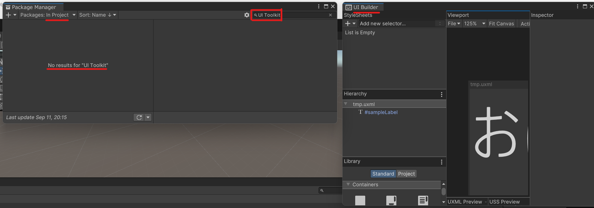

[【TOP】](../README.md)
# 概要
- 本ドキュメントはUnityの勉強備忘録です
- 学習者：([mossan-hoshi](https://twitter.com/mossan_hoshi))
- 予告なく見出しの構成が変わることがあります

# 備忘録
## UI
### [UI Toolkit](https://docs.unity3d.com/2021.2/Documentation/Manual/UIElements.html)
- 概要
  - 旧UI Elements
    - 2020年位に名前が変わっている。検索するときは注意
  - 2021年最新版UIツール
    - まだあまり使われていない。uGUIが一番使われているっぽい
  - XML的なマークダウンとスタイルシートでGUI構成を既定
    - .NETのWPFやQtのQuick的な思想(Web的な画面構成を目指す)だと思われれる
    - UXML≒HTML、USS≒CSS、C#≒JavaScript
- [導入手順](https://docs.unity3d.com/2020.2/Documentation/Manual/UITK-package.html)
  - `Add package from git URL…`から`com.unity.ui`を検索してインストール
- [基本](https://creator.game.cyberagent.co.jp/?p=7921)
  - 画面構成は`UI BUilder`(Windows->UI Toolkit->UI BUilder)で編集
    - Libraryの中のコントロールをHierarchyにドラッグアンドドロップして配置
      - 配置したコントロールはプロパティ変更可能
    - 保存すると`.uxml`として保存される
  - ~~[サンプルを追加でインストール可能](https://zenn.dev/shiena/articles/uitoolkit-sample)~~
    - 2021.2だとUI ToolkitがUnity内臓化？しており、package managerに出てこない
      
  - 