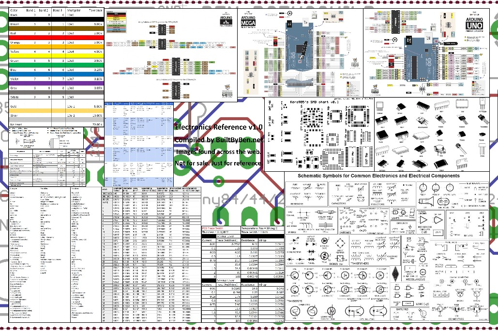

# 電子工作
## シミュレータ\(LTSpice\)

・とりあえず最近出てる電子工作本を見ると扱ってるシミュレータはほとんど**LTSpice**
  - LTSpiceとは
      - フリーで個人利用なら特に制限のないシミュレータ
        - インターフェイスはこのご時世には古臭い感じを受けるが、慣れれば使い勝手はそこそこ良い
      - 関連書籍
      - [\[実験&シミュレーション\!電子回路の作り方入門 \(トランジスタ技術SPECIAL\)](http://www.amazon.co.jp/%E5%AE%9F%E9%A8%93-%E3%82%B7%E3%83%9F%E3%83%A5%E3%83%AC%E3%83%BC%E3%82%B7%E3%83%A7%E3%83%B3-%E9%9B%BB%E5%AD%90%E5%9B%9E%E8%B7%AF%E3%81%AE%E4%BD%9C%E3%82%8A%E6%96%B9%E5%85%A5%E9%96%80-%E3%83%88%E3%83%A9%E3%83%B3%E3%82%B8%E3%82%B9%E3%82%BF%E6%8A%80%E8%A1%93SPECIAL/dp/4789849236/ref=sr_1_fkmr0_1?ie=UTF8&amp;qid=1387093403&amp;sr=8-1-fkmr0&amp;keywords=%E3%83%88%E3%83%A9%E6%8A%80SPECIAL++%E3%82%B7%E3%83%9F%E3%83%A5%E3%83%AC%E3%83%BC%E3%82%B7%E3%83%A7%E3%83%B3)
          - 電子回路の基礎的なことも一応説明してくれてる、どちらかというと親切な部類の本。
              ページ数も少ないので最初にこれで初めて感覚をつかむのは有りかも
          - インストール
      - [こちらのページ](http://www.linear-tech.co.jp/designtools/software/)から最新版をインストール
          - 会員登録を勧められるがしなくてもダウンロードは出来る
        - ショートカットキー\(以下、Win用\)
      - 素子配置
          - R ： レジスタ配置
            - C ： コンデンサ配置
            - L ： インダクタ配置
            - D ： ダイオード配置
            - G ： グラウンド配置
            - F2 ： コンポーネンツ\(任意素子\)配置
            - F3 ： 配線
          - 素子編集
          - \(素子の上でアイコンが指に変わった状態で\)右クリック ： 素子のパラメタ変更
            - F5 ： 削除
            - F6 ： コピー
                - F7 ： 移動
      - F8 ： ドラッグ
          - 編集全般
          - F9 ： 操作の取り消し
          - 表示
          - Space ： 全体表示
            - Ctrl\+Z ： 拡大
            - Ctrl\+B ： 縮小
            - Ctrl\+G ： グリッド表示切り替え
            - U ： 非接続端子をマーキング表示切り替え
            - A ： テキストアンカーのマーキング表示切り替え
            - Ctrl\+L ： エラーログ\(Spice形式\)表示
          - S ： Edit Text on the Schematic ： 回路全体につけるコメント等。SPICE文上に直接書き込む
        - T ： Edit Text on the Schematic ： 回路全体につけるコメント等。コメントとして記載
        - 
        - （素子を配置する際に） Ctrl\+R  ：  素子を回転
## 始めるにあたって必要なもの
  - ケース（回路＋電池）
    - マイクカバー
    - セット
    「工具編」
    - 各工具の説明はこちらを参照 http://miyauchi\-ss.com/bl\_k3.htm
    - はんだごて等\(Amazon\) http://amzn.to/17zRqhi
    - クリップスタンド\(Amazon\) http://amzn.to/17zU4Uj
    - テスター\(秋月\) http://akizukidenshi.com/catalog/g/gM\-00568/
      ・基本的には「回路がショートしてるか」「ちゃんと電圧が出てるか」ぐらいしか使わないけど、出番は多い
     - はんだ吸い取り機\(秋月\) http://akizukidenshi.com/catalog/g/gT\-03639/
      ・はんだ付けミスった時にはんだを取り除く用
     「部品編」
    - コンデンサマイク\(秋月\) http://bit.ly/17zXJBz
    - 抵抗
    - コンデンサ
    - 基板
    - ケーブル／プラグ
      ・3.5mmプラグ付きケーブル http://bit.ly/15vLrn2 これいいかも
        - 1.8mと長めなので余ったケーブルを「ボックス―レコーダー間」に使いまわせる
       ・プラグは形状がいろいろ種類があるのでおこのみでどうぞ
        （ http://www.marutsu.co.jp/ で「3.5mm プラグ」で検索すればいろいろ出てきます）
     - ジャック
      ・ボックスの中に隠れるので正直安ければなんでもいいかと
     - ケース\(候補\) http://bit.ly/15vMRhm
    
    「自分用」
    - バイス\(80mm以上\)
    - ミニルータ http://amzn.to/17DM6te ＋ http://amzn.to/17DMg44
    - ポンチ http://amzn.to/15m4EIX
    - ドリル http://amzn.to/15m4L7l
    - Arduino YUN\(長時間録音用\) [http://bit.ly/17wslSt](http://bit.ly/17wslSt)
    
## 電子工作早見表

http://builtbyben.net/electronics\-poster\-v1/
http://builtbybendotnet.files.wordpress.com/2013/09/electronicsposterv2.jpg

